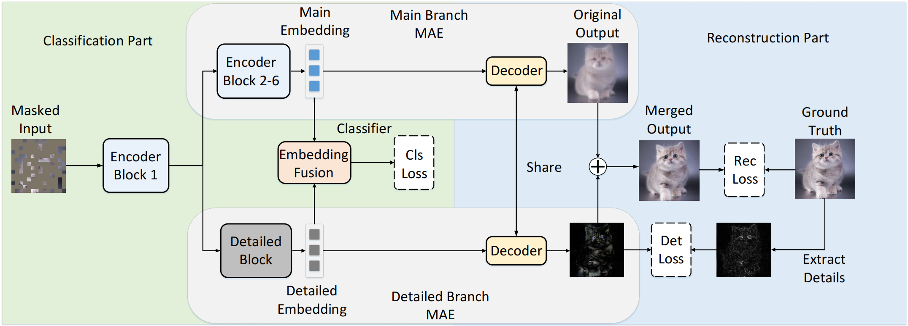

# MAE-CIL - Official PyTorch Implementation


### [ICCV 2023] Masked Autoencoders are Efficient Class Incremental Learners

[Paper](https://openaccess.thecvf.com/content/ICCV2023/papers/Zhai_Masked_Autoencoders_are_Efficient_Class_Incremental_Learners_ICCV_2023_paper.pdf)
## Usage

* Training on CIFAR-100 dataset:

```
$ sh sv.sh
```

## Environment

* We recommend you to use python3.6 as the base python environment. And other dependency libraries are listed in requirements.txt

```
$ pip install -r requirements.txt
```

## Data Download

* Please download the [MAE buffer](https://drive.google.com/file/d/1koQokl_-Ve_BfQhvCYeshUpqc7_zh-K_/view?usp=drive_link) used for training. After download it, please put it in the root folder.

## Acknowledge

* We use the codebase from [DyTox](https://github.com/arthurdouillard/dytox) to align some data processing implementations and evaluation metrics. Thanks for their wonderful work!

## Citation
If you use this code for your research, please consider citing:

```
@inproceedings{zhai2023masked,
  title={Masked autoencoders are efficient class incremental learners},
  author={Zhai, Jiang-Tian and Liu, Xialei and Bagdanov, Andrew D and Li, Ke and Cheng, Ming-Ming},
  booktitle={Proceedings of the IEEE/CVF International Conference on Computer Vision},
  pages={19104--19113},
  year={2023}
}
```
